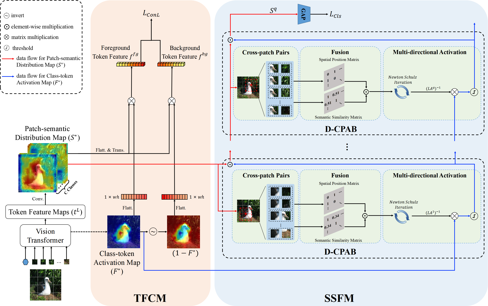

# Local Cross-Patch Activation from Multi-Direction for Weakly Supervised Object Localization

## Introduction
Weakly supervised object localization (WSOL) learns to localize objects using only image-level labels, which greatly reduces the cost on data annotation with bounding boxes. Traditional CNN-based WSOL methods usually achieve the localization results by activating the most discriminative
regions of different objects in images, while suffering the problem of partial activation. Recently, some studies use transformer to capture long-range feature dependency and alleviate the partial activation problem. However, transformer lacks the awareness of the semantic and spatial
coherence, as well as the capability of extracting local features similar to the receptive field of CNN. Therefore, it is difficult to activate complete regions of occluded objects. In addition, the background with similar texture and color to object boundaries is easily treated as part
of the object, causing the background to be over-activated. The above two cases easily lead to the poor localization performance. To solve this problem, we propose local cross-patch activation from multi-direction (LCA-MD) for WSOL, which aims to capture more details of local features 
while simultaneously inhibiting over-activation of the background. To this end, we propose a token feature contrast module (TFCM), which can pull close similar foreground and push apart dissimilar foreground-background in the token feature space by unsupervised contrastive learning. It
separates foreground and background more clearly to suppress over-activation of background. We further design a semantic-spatial fusion module (SSFM), which leverages cross-patch pairs selected from multi-direction to capture local cross-patch features and diffuse activation across occlusions.

## Architecture Overview
             

## Results and Models

| Datasets | Backbone | Top1-Loc Acc | Top5-Loc Acc | GT-Known | Top1-Cls Acc | Top5-Cls Acc |                       Checkpoints                                                                       |
|:--------:|:--------:|:------------:|:------------:|:--------:|:------------:|:------------:|:-------------------------------------------------------------------------------------------------------:| 
|   CUB    |  Deit-S  |     79.2     |     92.8     |   96.9   |     81.4     |     95.6     | [Google Drive](https://drive.google.com/drive/folders/1lstqS4qfnwWTn6pypyNt07s-cql7ZMkk?usp=share_link) |
|  ILSVRC  |  Deit-S  |     56.3     |     67.3     |   70.2   |     74.9     |     91.9     | [Google Drive](https://drive.google.com/drive/folders/1-eibe-Ckqha76eKhnSUceRKEu0Tdndrj?usp=share_link) |

### Visualization
We provide some visualization results as follows.


Note: Please refer to our paper for clearer and more detailed experimental results.
## Usage

### Installation
```
conda env create -f environment.yml
conda activate lca_md
```
### Dataset
To prepare the datasets, you can download CUB and ISVRC from the links below. 
```
CUB: https://www.vision.caltech.edu/datasets/cub_200_2011/
ISVRC: https://www.image-net.org/challenges/LSVRC/2012/
```

Then the absolute paths should be specified in the following config file paths.
```
.
├── CUB
│ ├── conformer_lca_md_small_patch16_224.yaml
│ ├── deit_lca_md_base_patch16_224.yaml
│ ├── deit_lca_md_small_patch16_224.yaml
│ ├── deit_tscam_base_patch16_224.yaml
│ ├── deit_tscam_small_patch16_224.yaml
│ ├── deit_tscam_tiny_patch16_224.yaml
│ └── vit_lca_md_small_patch16_224.yaml
└── ILSVRC
 ├── conformer_tscam_small_patch16_224.yaml
 ├── deit_lca_md_base_patch16_224.yaml
 ├── deit_lca_md_small_patch16_224.yaml
 ├── deit_tscam_base_patch16_224.yaml
 ├── deit_tscam_small_patch16_224.yaml
 └── deit_tscam_tiny_patch16_224.yaml
```

For instance in CUB/deit_lca_md_small_patch16_224.yaml:
```
DATA:
 DATASET: CUB
 DATADIR: /root/data/CUB_200_2011

TRAIN:
 BATCH_SIZE: 256

TEST:
 BATCH_SIZE: 256
```
You could change the DATADIR for the absolute path of the dataset or the BATCH_SIZE depending on your memory.

### Traing
Please use the commands below to launch LCA-MD. Replace {config_file} with the config file path you set up and {lr} with learning rate you set up.
```
python tools_cam/train_cam.py --config_file {config_file} --lr {lr}
```
```
# CUB
python tools_cam/train_cam.py --config_file ./configs/CUB/deit_lca_md_small_patch16_224.yaml --lr 5e-5
# ILSVRC
python tools_cam/train_cam.py --config_file ./configs/ILSVRC/deit_lca_md_small_patch16_224.yaml --lr 1e-6
```


### Testing
Specify the path of .pth file for testing and visualization. 
```
# CUB
python tools_cam/test_cam.py --config_file ./configs/CUB/deit_lca_md_small_patch16_224.yaml --resume ${pth_file_path}
# ILSVRC
python tools_cam/test_cam.py --config_file ./configs/ILSVRC/deit_lca_md_small_patch16_224.yaml --resume ${pth_file_path}


 --resume ${pth_file_path}
```


